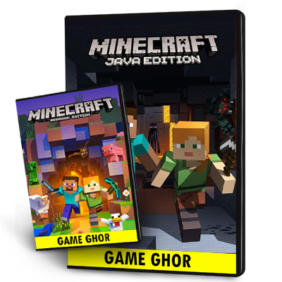
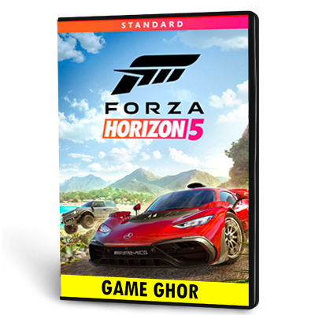

<html lang="en">
<head>
    <meta charset="UTF-8">
    <meta name="viewport" content="width=device-width, initial-scale=1.0">
    <title>RRX | YOUR AURA, YOUR RULES</title>
    <link href="https://fonts.googleapis.com/css2?family=Orbitron:wght@500;800&family=Rajdhani:wght@400;700&display=swap" rel="stylesheet">
    
</head>
<body>

    

        

            <h2>RRX CORE</h2>
            
আপনার বিশ্বস্ত গেমিং মার্কেটপ্লেস। দ্রুত ডেলিভারি এবং সিকিউর লেনদেনের নিশ্চয়তা।

            আপনার বিশ্বাস, আমাদের আমানত।
            <button class="continue-btn" onclick="enterSite()">Enter RRX CORE</button>
        

    

    

        

            <button onclick="closePayment()" style="background: none; border: none; color: #666; cursor: pointer; font-family: 'Orbitron'; margin-bottom: 20px;">[ BACK TO STORE ]</button>
            <h2 style="font-family: 'Orbitron'; color: var(--rrx-red); margin-bottom: 10px;">CHECKOUT</h2>
            

            
            

                
bKash <small>01XXXXXXXXX</small>

                
Nagad <small>COMING SOON</small>

            

            <form action="#">
                <input type="text" placeholder="Your Full Name" required>
                <input type="text" placeholder="Game Player ID / Account Email" required>
                <input type="text" placeholder="bKash Transaction ID (TrxID)" required>
                
* পেমেন্ট কমপ্লিট করার পর TrxID দিয়ে সাবমিট করুন।

                <button type="submit" class="submit-btn">CONFIRM ORDER</button>
            </form>
        

    

    <header>
        
RRX

    </header>

    <main id="main-content">
        <section class="hero">
            <h1>RRX CORE</h1>
            
YOUR AURA, YOUR RULES

        </section>

        

            

                
AVAILABLE

                

                <h3 class="p-name">Minecraft Java + Bedrock Edition (Combo)</h3>
                ৳ 2,000
                <button class="buy-now-btn" onclick="openPayment('Minecraft Combo - ৳ 2,000')">BUY NOW</button>
            

            

                
AVAILABLE

                

                <h3 class="p-name">Grand Theft Auto 5 | GTA V – Premium Edition</h3>
                ৳ 2,100
                <button class="buy-now-btn" onclick="openPayment('GTA V Premium - ৳ 2,100')">BUY NOW</button>
            

            

                
AVAILABLE

                

                <h3 class="p-name">Forza Horizon 5 – Premium Edition | Steam</h3>
                ৳ 3,999
                <button class="buy-now-btn" onclick="openPayment('Forza Horizon 5 - ৳ 3,999')">BUY NOW</button>
            

        

    </main>

    <footer>
        
&copy; 2026 RRX BRAND | POWERED BY RRX STUDIOS

    </footer>

    
</body>
</html>
